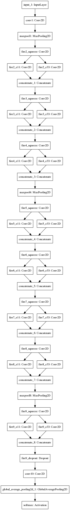

# SqueezeNet Keras Implementation
This is a Keras implementation of [SqueezeNet](https://arxiv.org/pdf/1602.07360.pdf) (arXiv 1602.07360) using the Keras functional API.

SqueezeNet boasts AlexNet-level accuracy with 50x fewer parameters and 4.8MB model size. Through Deep Compression and further quantization, SqueezeNet can maintain AlexNet-level accuracy with 510x fewer parameters and 0.47MB model size. The original model was implemented in Caffe [here](https://github.com/DeepScale/SqueezeNet).

**Full Reference**:
Iandola, F.N., Han, S., Moskewicz, M.W., Ashraf, K., Dally, W.J. and Keutzer, K., 2016. SqueezeNet: AlexNet-level accuracy with 50x fewer parameters and< 0.5 MB model size. arXiv preprint arXiv:1602.07360.

## Reference
[SqueezeNet Keras Implementation by DT42](https://github.com/DT42/squeezenet_demo)

Differences:
- Create function `fire_module` to simplify code
- Create variables for data format, kernel initialisation, activation function for easier modifications

## Result
This repository contains only the Keras implementation of the model.

In future I plan to test the model on CIFAR-10, CIFAR-100 and other computer vision benchmarks.

## Model Visualization

