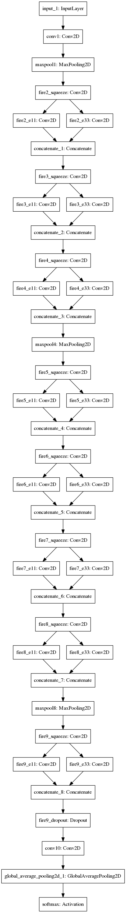

# SqueezeNet Keras Implementation
This is a Keras implementation of [SqueezeNet](https://arxiv.org/pdf/1602.07360.pdf) (arXiv 1602.07360) using the Keras functional API.

SqueezeNet boasts AlexNet-level accuracy with 50x fewer parameters and 4.8MB model size. Through Deep Compression and further quantization, SqueezeNet can maintain AlexNet-level accuracy with 510x fewer parameters and 0.47MB model size. The original model was implemented in Caffe [here](https://github.com/DeepScale/SqueezeNet).

**Full Reference**:
Iandola, F.N., Han, S., Moskewicz, M.W., Ashraf, K., Dally, W.J. and Keutzer, K., 2016. SqueezeNet: AlexNet-level accuracy with 50x fewer parameters and< 0.5 MB model size. arXiv preprint arXiv:1602.07360.


## Reference
[SqueezeNet Keras Implementation by DT42](https://github.com/DT42/squeezenet_demo)

Differences:
- Create function `fire_module` to simplify code
- Create variables for data format, kernel initialisation, activation function for easier modifications
- Include models SqueezeNet v1.0 and SqueezeNet v1.1

**What's new in SqueezeNet v1.1?**

|                 | SqueezeNet v1.0                  | SqueezeNet v1.1                  |
| :------------- |:-------------:| :-----:|
| conv1:          | 96 filters of resolution 7x7     | 64 filters of resolution 3x3     |
| pooling layers: | pool_{1,4,8}                     | pool_{1,3,5}                     |
| computation     | 1.72 GFLOPS/image                | 0.72 GFLOPS/image: *2.4x less computation* |
| ImageNet accuracy        | >= 80.3% top-5                   | >= 80.3% top-5                   |    

SqueezeNet v1.1 has 2.4x less computation than v1.0, without sacrificing accuracy.

## Result
This repository contains only the Keras implementation of the model.

The model is tested on CIFAR-10 & CIFAR-100 and achieves the following performance:
```
loss: 0.xxxx - acc: 0.xxxx - val_loss: 0.xxxx - val_acc: xxxx
```


## Model Visualization

