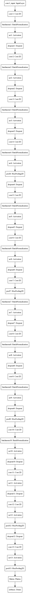

# SimpleNet Keras Implementation
This is a Keras implementation of [SimpleNet](https://arxiv.org/abs/1608.06037) (arXiv 1608.06037) using the Keras sequential model.

This implementation follows the original model implemented in Caffe [here](https://github.com/Coderx7/SimpleNet).

**Full Reference**:
Hasanpour, S.H., Rouhani, M., Fayyaz, M. and Sabokrou, M., 2016. Lets keep it simple, Using simple architectures to outperform deeper and more complex architectures. arXiv preprint arXiv:1608.06037.

## Model Visualization

